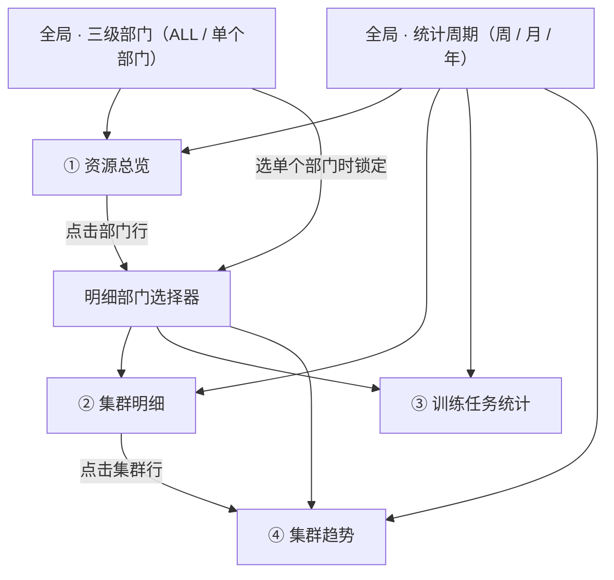

# 算力资源看板 UI 设计文档

- 版本：v3（2026-09-29）
- 参考实现：[index.html](index.html)（单文件，图表使用 d3.js v7.9.0）
- 在线演示：https://claude.ai/artifact/PMghKKRTbzSXj3Vufhovo1

---

## 1. 概述

看板是一个单页只读仪表盘，让算力运营和部门负责人在一屏内回答三个问题：

1. 各三级部门的卡用得怎么样？
2. 哪些集群利用率偏低或已经满载？
3. 部门的训练任务把卡时花在了哪里？

数据按「三级部门 → 集群 → 卡」三层组织。集群只分两类：**NPU 集群**（昇腾 910B）和 **GPU 集群**（NVIDIA 卡）。页面顶部有两个全局筛选：三级部门（ALL 或单个部门）和统计周期（周 / 月 / 年）。

| 角色 | 主要问题 | 常用模块 |
| --- | --- | --- |
| 算力平台运营 | 哪些集群利用率低、哪些满载需要扩容 | 资源总览、集群明细、集群趋势 |
| 三级部门负责人 | 本部门的卡用得好不好 | 全局筛选到本部门后看全部模块 |
| 算法团队负责人 | 任务时长与卡时分布是否合理，大任务占了多少资源 | 训练任务统计 |

### 设计原则

- **先汇总后明细**：从部门总览到集群明细，再到单个集群的趋势，自上而下逐层下钻。
- **筛选集中在顶部**：三级部门和统计周期都放在吸顶工具栏，所有模块口径一致，数字之间能对上。
- **固定的指标颜色**：GPU 利用率始终是蓝色，GPU 调度率始终是橙色，表格和折线图一致。
- **信息克制**：只展示当期数值；不展示环比、占比、节点数、区域、用途、型号规格等次要信息。

---

## 2. 信息架构

| 层级 | 演示数据规模 | 页面上展示的属性 |
| --- | --- | --- |
| 三级部门 | 6 个 | 名称、上级路径（一级 › 二级） |
| 集群 | 29 个（NPU 4 个、GPU 25 个），每个部门 4–6 个 | 名称、类型（NPU / GPU）、卡数、利用率、调度率 |
| 卡 | 29,056 张 | 只以「卡数」汇总出现 |

筛选、选择器与四个模块的关系：



- **统计周期**作用于全部模块。
- **全局三级部门**：选 ALL 时总览列出全部部门，明细部门选择器可自由切换；选单个部门时总览只剩该部门，明细部门选择器被锁定为同一个部门。
- **明细部门选择器**决定集群明细、训练任务统计和集群趋势。在总览表点击部门行也会切换它。
- **集群**只决定集群趋势，由集群明细中的行点击选择。

---

## 3. 页面布局与栅格

桌面端是单列纵向流，自上而下依次为：

| 区域 | 宽度 | 内容 |
| --- | --- | --- |
| 页头 | 通栏 | 左：图标 + 标题「AI 算力资源看板」+ 副标题；右：深浅色开关 + 「演示数据 · 随机生成」标签 |
| 吸顶工具栏 | 通栏 | 三级部门筛选 · 竖线分隔 · 统计周期（周 / 月 / 年分段控件、周期按钮与前后箭头）· 状态标识 · 范围说明 |
| ① 资源总览 | 通栏 | 标题 + 总览表 |
| ② 集群明细 | 1.3fr | 左上角明细部门选择器 + 按集群类型合并分组的集群表 |
| ③ 训练任务统计 | 1fr | 2 个 KPI + 2 个环形饼图 |
| ④ 集群趋势 | 通栏 | 所选集群的利用率 / 调度率折线图 |
| 口径说明 | 通栏 | 4 条定义，自适应多列 |

```
┌ 页头 ─────────────────────────────────────────────────────┐
├ 吸顶工具栏：三级部门 │ 统计周期 ───────────────────────────┤
├ ① 资源总览（通栏） ────────────────────────────────────────┤
├ ② 集群明细（1.3fr）─────────────┬ ③ 训练任务统计（1fr）────┤
├ ④ 集群趋势（通栏） ─────────────┴──────────────────────────┤
└ 口径说明 ──────────────────────────────────────────────────┘
```

趋势图放通栏，是为了让一周 168 个小时点有足够的横向分辨率。

### 3.1 间距

| 项 | 取值 |
| --- | --- |
| 内容最大宽度 | 1440px，居中 |
| 页面左右留白 | `clamp(16px, 3vw, 32px)` |
| 页面上下留白 | 顶部 24px，底部 40px |
| 模块间距 | 16px，纵向与横向相同 |
| 卡片内边距 | 上 20 · 左右 20 · 下 16px；视口 ≤ 640px 时为 16 · 14 · 12px |
| 模块头与内容 | 16px |
| 表格单元格 | 12px；集群明细的平均行上下 10px |
| 吸顶工具栏 | 内边距 10px，左右各外扩 10px，使控件与卡片内容对齐；控件间距 14px |
| 锚点滚动偏移 | 76px，避开吸顶工具栏 |

### 3.2 断点

| 条件 | 布局变化 |
| --- | --- |
| 视口 > 1120px | 集群明细与训练任务统计并排（1.3fr : 1fr），两卡等高 |
| 视口 ≤ 1120px | 两者改为上下堆叠，各占满宽 |
| 视口 ≤ 640px | 卡片内边距收紧；趋势图高 240px、刻度减半；工具栏换行，范围说明占独立一行 |
| 训练任务卡片 ≤ 440px（容器查询） | 两个饼图上下排列 |
| 任何宽度 | 页面本身不横向滚动；总览表（最小 760px）和明细表（最小 600px）在卡片内横向滚动 |

---

## 4. 视觉规范

整体是冷调中性灰底 + 白卡片，只有数据带颜色。所有颜色定义为 CSS token，浅色与深色各有一套取值。

### 4.1 基础色

| Token | 浅色 | 深色 | 用途 |
| --- | --- | --- | --- |
| `--bg` | #eef1f5 | #0c0f14 | 页面底色 |
| `--surface` | #fcfdfe | #151a21 | 卡片、弹层、图表底、集群类型合并格 |
| `--surface-2` | #f3f5f8 | #1b212a | 平均行、悬停底色、芯片、锁定的选择器 |
| `--seg-bg` | #e5e9ef | #1a2029 | 分段控件底色、主题开关轨道 |
| `--ink` | #121923 | #edf1f6 | 主文字、选中圆点 |
| `--ink-2` | #4a5465 | #b2bbc8 | 次级文字 |
| `--muted` | #6b7686 | #8792a2 | 说明文字、表头、坐标轴 |
| `--line` | #e2e6ec | #242b35 | 分隔线、网格线 |
| `--line-2` | #cbd2dc | #343d4a | 控件描边、基线、十字线、集群类型组间分隔 |
| `--sel` | #edf2f9 | #1c2533 | 选中行底色 |
| `--focus` | #2a78d6 | #6aa6ee | 键盘焦点环 |

### 4.2 指标色与状态色

| Token | 浅色 | 深色 | 用途 |
| --- | --- | --- | --- |
| `--util` | #2a78d6 | #3987e5 | GPU 利用率：进度条、折线、面积 |
| `--util-track` | #dde9f8 | #1b2a3f | 利用率进度条轨道 |
| `--sched` | #eb6834 | #d95926 | GPU 调度率：进度条、折线 |
| `--sched-track` | #fbe6dc | #3a241b | 调度率进度条轨道 |
| `--up` | #13803f | #3cc06e | 「进行中」状态圆点 |

利用率 / 调度率两色在色盲模拟下 ΔE 为 24.7（浅）/ 26.8（深），对卡片底色的对比度均 ≥ 3:1。

### 4.3 饼图配色

两个饼图使用同一组 5 种高区分度的分类色，分桶 i 固定取第 i 个颜色，两个图之间颜色含义一致（第 1 档最短 / 最小，第 5 档最长 / 最大）。

| Token | 浅色 | 深色 | 色相 |
| --- | --- | --- | --- |
| `--c1` | #2a78d6 | #3987e5 | 蓝 |
| `--c2` | #eb6834 | #d95926 | 橙 |
| `--c3` | #1baf7a | #199e70 | 青绿 |
| `--c4` | #eda100 | #c98500 | 黄 |
| `--c5` | #e87ba4 | #d55181 | 品红 |

校验结果（环形排列，第 5 档与第 1 档相邻也计入）：

| 检查项 | 浅色 | 深色 |
| --- | --- | --- |
| 色盲模拟下相邻两色最小 ΔE（≥ 8 为达标） | 9.1 | 8.4 |
| 正常视觉相邻两色最小 ΔE（≥ 15 为达标） | 19.6 | 19.3 |
| 对卡片底色对比度 | 青绿 2.76、黄 2.13、品红 2.64 低于 3:1 | 全部 ≥ 3:1 |

浅色下三种颜色对比度不足 3:1，由图例补偿：每个分桶的数值和占比都以文字列出，不依赖颜色识别。

### 4.4 字体与字号

- 数字与拉丁字符用 **Barlow**（DIN 风格，数字紧凑），中文回落到 PingFang SC / Hiragino Sans GB / 微软雅黑 / Noto Sans CJK SC。
- 集群名、集群类型（NPU / GPU）和芯片用 **IBM Plex Mono**，表明它们是系统标识。
- 表格数字列和坐标轴使用等宽数字（`tabular-nums`）；KPI 大数字使用比例数字。

| 层级 | 字号 / 字重 | 用于 |
| --- | --- | --- |
| 页面标题 | 20 / 600 | 「AI 算力资源看板」 |
| 模块标题 | 16 / 600 | 四个模块的 H2 |
| 选择器当前值 | 15 / 600 | 三级部门筛选、周期按钮、明细部门选择器 |
| 表格重点 | 14.5 / 600 | 部门名、卡数 |
| 正文 | 14 / 400 | 表格正文、「平均」（600） |
| 集群名、集群类型 | 13 / 500–600（等宽） | 集群明细 |
| 说明 | 12.5 / 400 | 模块副标题、图例、主题开关文字 |
| 辅助 | 11.5–12 / 400–500 | 表头、坐标轴、状态标签 |
| KPI | 26 / 600 | 任务总数、总训练卡时 |
| 饼图中心值 | 22 / 600 | 两个环形饼图 |

### 4.5 形状与层次

- 圆角：卡片 16px，弹层 14px，按钮与选择器 9–10px，芯片 6px，状态标签和主题开关全圆角。
- 卡片：1px `--line` 描边 + 轻阴影（`0 1px 2px` 与 `0 10px 28px -18px`）；弹层阴影更重。
- 图标：内联 SVG，1.4–1.6px 线宽，圆头圆角，不使用 emoji。

---

## 5. 全局控件

吸顶工具栏从左到右：**三级部门筛选** · 1px 竖线 · 「统计周期」标签 · 周 / 月 / 年分段控件 · 上一期 · 周期按钮 · 下一期 · 状态标识 · （最右）范围说明。

工具栏 `position: sticky`，顶部偏移等于安全区域；背景为 84% 页面底色 + 12px 背景模糊。

### 5.1 三级部门筛选

- **按钮**：高 36px，显示「三级部门 | ALL ▾」或「三级部门 | 预训练部 ▾」，当前值 15 / 600。
- **下拉列表**：宽 320px。第一项是「ALL · 全部三级部门 · 29 集群 · 29,056 卡」，下方一条分隔线；之后每项为勾选标记 + 部门名 + 上级路径 + 「6 集群 · 11,776 卡」。打开时焦点落在当前项；↑ / ↓ 移动，Enter 选中，Esc 或点击外部关闭。
- **选择后的效果**：

| 选择 | 资源总览 | 明细部门选择器 | 范围说明 |
| --- | --- | --- | --- |
| ALL | 列出全部 6 个部门 + 合计行 | 可自由切换 | 「6 个三级部门 · 29 个集群 · 29,056 卡」 |
| 单个部门 | 只列该部门，合计行隐藏 | 切换为该部门并锁定 | 「4 个集群 · 1,920 卡」 |

### 5.2 时间选择器

切换后四个模块同时刷新。默认选中上一个完整的 ISO 周。

**周期格式**

| 粒度 | 周期按钮标签 | 日期范围 | 示例 |
| --- | --- | --- | --- |
| 周 | 20xx年第xx周（ISO 8601，周一开始） | MM.DD – MM.DD | 2026年第39周 · 09.21 – 09.27 |
| 月 | 20xx年xx月 | MM.01 – MM.月末 | 2026年9月 · 09.01 – 09.30 |
| 年 | 20xx年 | 01.01 – 12.31 | 2025年 · 01.01 – 12.31 |

跨年的周按 ISO 周年归属，例如 2026年第1周是 12.29 – 01.04。

**组件规格**

| 组件 | 尺寸 | 状态与行为 |
| --- | --- | --- |
| 分段控件 | 内边距 3px，按钮 4 × 14px，圆角 10 / 7px | 选中项白底 + 细阴影；切换粒度后关闭弹层 |
| 周期按钮 | 高 36px，15 / 600 | 日历图标 + 标签 + 灰色日期范围 + 下拉箭头；点击开关弹层 |
| 上一期 / 下一期 | 32 × 32px | 超出范围时禁用（透明度 35%）；最早 2024-01-01，最晚为当前周期 |
| 状态标识 | 12.5px，7px 圆点 | 已完结：灰点；进行中：绿点 + 光晕，文字「进行中 · 数据截至 09/29 15:00」 |
| 弹层 | 宽 348px，不超过屏宽 − 32px | 位于按钮下方 8px；点击外部或 Esc 关闭，焦点回到周期按钮 |

**弹层内容**

- **周**：顶部年份切换（‹ 2026 年 ›）。下方按月份分 12 行，每行左侧是月份名，右侧是该月的 4–5 个周号；一周归入它周四所在的月份。悬停或聚焦周号时，底部显示「2026年第39周 · 09.21 – 09.27」。
- **月**：年份切换 + 4 × 3 的月份网格。
- **年**：列出 2024 年至今年，每行 3 个。
- 单元格状态：当前选中为深色底白字；进行中的周期右上角加 5px 绿点；未来周期禁用（透明度 30%）。

**切换规则**

1. 切换粒度时，以当前周期的最后一天（不晚于今天）为参照，选中新粒度下包含这一天的周期。例如第39周切到月 → 2026年9月。
2. 切到周时如果落在进行中的周，退到上一个完整周。
3. 切换周期不改变三级部门筛选、明细部门和所选集群。

### 5.3 深浅色开关

- 位置：页头右侧，「演示数据」标签左边。
- 形态：44 × 24px 全圆角轨道 + 18px 圆形滑块，滑块内显示当前模式的图标（浅色为太阳，深色为月亮）；开关右侧文字「浅色」/「深色」。
- 语义：`role="switch"`，`aria-checked="true"` 表示深色；点击或空格切换，滑块 200ms 平移。
- 初始状态：用户手动选过则用手动选择，否则跟随系统设置。
- 记忆：选择写入 `localStorage`（键 `resource-board-theme`）；页面顶部的内联脚本在首次绘制前读取它，避免先闪一下系统主题。存储不可用时只在本次访问内生效。
- 实现：切换只改 `<html data-theme>`，所有颜色都是 token，图表不需要重绘。

---

## 6. 模块一：资源总览

总览表每个三级部门一行，比较卡量规模和两个比率；底部是全部集群的合计行。显示哪些部门由全局三级部门筛选决定；点击一行进入该部门的集群明细。

### 6.1 模块头

- 左侧：标题「资源总览」+ 副标题。ALL 时副标题为「全部 6 个三级部门 · 利用率与调度率按卡数加权」；单个部门时为「智能终端事业部 › 语音与视觉中心 › 语音交互部 · 利用率与调度率按卡数加权」。
- 右侧提示「点击部门查看集群明细」。

### 6.2 列定义

| 列 | 内容 | 对齐 | 规格 |
| --- | --- | --- | --- |
| 三级部门 | 部门名 + 上级路径 | 左 | 部门名 14.5 / 600；路径 12px 灰色 |
| 集群 | 集群数 | 右 | 整数 |
| 集群类型 | 类型芯片「NPU ×1」「GPU ×5」 | 左 | 等宽 11.5px，单行不换行；NPU 在前 |
| 总卡数 | 卡数 | 右 | 14.5 / 600，千分位；可排序 |
| GPU 利用率 | 进度条 + 数值 | 进度条左，数值右 | 蓝色；可排序 |
| GPU 调度率 | 进度条 + 数值 | 同上 | 橙色；可排序 |
| （行尾） | 右箭头 | 右 | 灰色，行悬停时变为主文字色 |

**进度条单元格**：两列栅格，进度条（最小 64px，自适应）· 数值（50px，右对齐，600），列间距 10px。进度条高 6px、圆角 3px；轨道用同色浅档，填充宽度等于数值。切换数据时填充宽度从旧值过渡到新值（450ms，cubic-out）。

### 6.3 排序、行与合计

- 可排序列为总卡数、GPU 利用率、GPU 调度率，默认按总卡数降序。点击表头切到该列降序，再点一次切到升序。当前列显示 ↓ / ↑，其余可排序列显示淡色 ↕，并设置 `aria-sort`。
- 行内边距 12px，行间 1px 分隔线；悬停底色 `--surface-2`；当前明细部门对应的行保持 `--sel` 底色。
- 点击行或聚焦后按 Enter / 空格：把该部门设为明细部门，并平滑滚动到集群明细。
- **合计行**：只在全局筛选为 ALL 时显示。位于表尾，上方 1px `--line-2` 描边，字重 600；集群类型列为「NPU ×4 GPU ×25」，比率为全部集群按卡数加权。合计行不参与排序。

---

## 7. 模块二：集群明细

集群明细列出所选三级部门的全部集群。第一列「集群类型」按 NPU / GPU 合并单元格，同类型集群放在一起；每组的第一行是「平均」，即该类型集群的平均指标。点击集群行驱动集群趋势。

### 7.1 模块头

- **明细部门选择器**（左上角）：与全局三级部门筛选是同一个组件，但没有 ALL 选项，按钮高 40px。
  - 全局筛选为 ALL 时可以自由切换部门。
  - 全局筛选为单个部门时，按钮被锁定：显示该部门名，底色 `--surface-2`，不显示下拉箭头，悬停提示「已由顶部的三级部门筛选决定」。
- 选择器右侧：标题「集群明细」+ 副标题「按 NPU / GPU 集群分组 · 点击集群查看趋势」。
- 模块头最右侧汇总「**6** 个集群 · **11,776** 卡」，数字加粗。

### 7.2 表格结构

五列：集群类型 · 集群名称 · 卡数 · GPU 利用率 · GPU 调度率。表格最小宽度 600px。

```
┌────────┬────────────────────┬───────┬──────────────┬──────────────┐
│集群类型│集群名称            │  卡数 │ GPU 利用率   │ GPU 调度率   │
├────────┼────────────────────┼───────┼──────────────┼──────────────┤
│        │ 平均               │ 2,048 │ ▬▬▬▬   59.1% │ ▬▬▬▬▬  89.8% │
│  NPU   ├────────────────────┼───────┼──────────────┼──────────────┤
│        │ ○ gy-910b-train-01 │ 2,048 │ ▬▬▬▬   59.1% │ ▬▬▬▬▬  89.8% │
├────────┼────────────────────┼───────┼──────────────┼──────────────┤
│        │ 平均               │ 9,728 │ ▬▬▬▬   60.1% │ ▬▬▬▬▬  88.2% │
│        ├────────────────────┼───────┼──────────────┼──────────────┤
│  GPU   │ ● wlcb-h800-train-01│ 4,096 │ ▬▬▬▬   61.1% │ ▬▬▬▬▬  91.1% │
│        ├────────────────────┼───────┼──────────────┼──────────────┤
│        │ ○ …                │   …   │ …            │ …            │
└────────┴────────────────────┴───────┴──────────────┴──────────────┘
```

| 元素 | 规格 |
| --- | --- |
| 集群类型格 | 纵向合并（rowspan = 该组集群数 + 1），宽 84px，文字居中，等宽 13 / 600；底色 `--surface`，右侧 1px `--line` 竖线 |
| 平均行 | 每组第一行；集群名称列写「平均」（600，左侧缩进 36px，与集群名对齐）；卡数为该组合计；两个比率为该组按卡数加权的平均值，带进度条；底色 `--surface-2`，不可点击 |
| 集群行 | 单选圆点 + 集群名（等宽 13 / 500，如 `wlcb-h800-train-01`）+ 状态标签（如有）；卡数；两个进度条单元格 |
| 组间分隔 | 两组之间用 1px `--line-2`，组内行间用 1px `--line` |

- 组的顺序固定为 NPU 集群在前、GPU 集群在后；部门没有某类集群时不显示该组。组内集群按卡数降序。
- 集群行**不展示**区域、用途、型号规格、节点数，也不展示「低利用」提示。

### 7.3 状态标签

| 标签 | 触发条件 | 样式 |
| --- | --- | --- |
| 满载 | 当期 GPU 调度率 ≥ 95% | 中性灰底 + 1px 描边 + 电池图标，11 / 500，全圆角 |

标签显示在集群名下方；不满足条件时这一行只有集群名。

### 7.4 选中态

- 集群行可点击、可 Tab 聚焦，Enter / 空格激活。
- 选中行：圆点变为实心（主文字色），行底色 `--sel`。
- 切换明细部门后默认选中该部门卡数最多的集群。
- 选中集群只更新行高亮和趋势图，不重绘表格。

---

## 8. 模块三：训练任务统计

模块三统计明细部门全部集群在当前周期内的训练任务，用 2 个 KPI 和 2 个环形饼图说明任务数量、时长结构和卡时去向。左图看任务结构，右图看资源去向，两者对照能看出少数大任务占了大部分卡时。

模块头：标题「训练任务统计」，副标题「预训练部 · 全部 6 个集群 · 2026年第39周」，进行中的周期追加「（进行中）」。

### 8.1 KPI 条

一个 1px 外框、圆角 12px 的条带，等分为 2 格，格间 1px 竖线。每格上方是 12px 灰色标签，下方是 26 / 600 数值 + 12px 单位。

| KPI | 单位 | 示例 |
| --- | --- | --- |
| 任务总数 | 个 | 203 个 |
| 总训练卡时 | 万 / 亿（标签已含「卡时」） | 125 万 |

### 8.2 两个环形饼图

| 项 | 训练时长分布 | 训练卡时分布 |
| --- | --- | --- |
| 标题右侧说明 | 按任务数 | 按单任务卡时区间 |
| 扇区数值 | 该分桶的任务数 | 该分桶任务的卡时总和 |
| 分桶（颜色 1 → 5） | < 1 小时 · 1–6 小时 · 6–24 小时 · 1–7 天 · > 7 天 | < 100 · 100–1千 · 1千–1万 · 1万–10万 · ≥ 10万（卡时） |
| 中心默认 | 任务总数 +「训练任务」 | 总卡时 +「训练卡时」 |
| 中心悬停 | 占比 + 分桶名 +「76 个任务」 | 占比 +「1万–10万 卡时」+「17 个任务」 |
| 图例数值 | 任务数（个） | 卡时（万） |

**环形规格**

- 外半径 84、内半径 56（viewBox 184，显示宽度最大 184px，按容器等比缩小）。
- 扇区间隙 padAngle 0.024（约 2px，透出卡片底色），扇区圆角 3。
- 扇区按分桶顺序从 12 点钟方向顺时针排列，不按大小重排，颜色与分桶一一对应。
- 颜色见 4.3，两个饼图共用 `--c1` … `--c5`。
- 数值为 0 的分桶不画扇区，但在图例中保留并显示 0。
- 切换数据时扇区角度从旧值插值到新值，450ms。

**悬停与图例**

- 悬停或聚焦扇区：该扇区外扩 5，其余扇区降到 30% 不透明度，对应图例行加底色，中心文字换成该分桶的信息；离开后恢复。
- 图例在饼图下方，每行四列：10px 色块（圆角 3）· 分桶名 · 数值 · 占比（46px 右对齐）。悬停图例行与悬停扇区效果相同。
- 图例列出每个分桶的数值与占比，不需要悬停也能读到全部数据。
- 模块宽度 ≤ 440px 时两个饼图上下排列。

---

## 9. 模块四：集群趋势

折线图展示集群明细中选中集群的 GPU 利用率和调度率随时间的变化。两条线都是百分比，共用一根 0–100% 的 Y 轴，不使用双轴。

### 9.1 模块头

- 左侧：标题「集群趋势」+ 集群名徽标（等宽 14px，浅底描边）；副标题「GPU 集群 · 4,096 卡 · 预训练部」。
- 右侧：图例，只有两项，每项为 16 × 2px 线段 + 指标名（「GPU 利用率」「GPU 调度率」）。不显示均值，也不提供图表 / 数据表切换。

### 9.2 时间粒度与 X 轴

| 周期 | 聚合粒度 | 点数 | X 轴刻度 |
| --- | --- | --- | --- |
| 周 | 每小时 | 168 | 7 个，标签居中于当天中午「09/21 周一」；每天 0 点画一条浅色竖线分隔 |
| 月 | 每天 | 28–31 | 1、6、11、16、21、26 日，「09/01」 |
| 年 | 每 ISO 周 | 52–53 | 每月 1 日，「1月」…「12月」 |

图表宽度 < 640px 时刻度减半：周只显示「周一」，月只显示 1、11、21 日，年隔月显示。

### 9.3 绘制规格

| 元素 | 规格 |
| --- | --- |
| 画布 | 高 300px（窄屏 240px），宽度跟随容器；边距 上 14 · 右 58（窄屏 46）· 下 30 · 左 44 |
| Y 轴 | 0 / 25 / 50 / 75 / 100%，标签右对齐在绘图区左侧 10px |
| 网格线 | 1px 实线 `--line`，0% 基线用 `--line-2` |
| 折线 | 2px，圆头圆角，单调三次曲线；调度率先画、利用率后画 |
| 面积 | 只在利用率下方，`--util` 10% 不透明度 |
| 末端点 | r = 4，填充系列色，2px 卡片底色描边 |
| 末端标签 | 末端点右侧 9px 写最新值，600，主文字色；两标签垂直距离 < 14px 时都不显示 |
| 进行中周期 | X 轴仍覆盖整个周期，线在当前时刻结束；空白区宽于 200px 时在其中部写灰字「数据更新至 09/29 15:00」 |

### 9.4 悬停与键盘

- 整个绘图区都是命中区，指针不必落在线上。
- 十字线：1px `--line-2` 竖线，吸附到离指针最近的数据点；两条线上各显示一个 r = 4.5 的点。
- 提示框：顶部为时间（周「09/23 周三 14:00」，月「2026/09/23 周三」，年「第23周 · 06/01–06/07」），下面两行为 14px 线段色键 + 加粗数值 + 灰色指标名。默认放在十字线右侧 14px，放不下时翻到左侧。
- 键盘：图表可 Tab 聚焦，聚焦时显示最后一个点；← / → 逐点移动，Home / End 跳到首尾，Esc 隐藏。
- 模块底部说明行：「按小时聚合 · 2026年第39周（09.21 – 09.27）· 悬停或聚焦图表后用 ← → 键查看数值」。

---

## 10. 交互与状态

页面只有 5 个状态量；每次交互只改其中一个，再按依赖关系重绘受影响的模块，其余模块保持不动。

| 状态 | 默认值 | 修改入口 | 重绘范围 |
| --- | --- | --- | --- |
| 全局三级部门 | ALL | 工具栏三级部门筛选 | 工具栏和全部四个模块 |
| 统计周期（粒度 + 具体周期） | 上一个完整 ISO 周 | 分段控件、周期弹层、上一期 / 下一期 | 工具栏和全部四个模块 |
| 明细部门 | 列表第一个部门（预训练部） | 总览行点击、明细部门选择器、全局筛选选单个部门 | 集群明细、训练任务统计、集群趋势；总览只更新高亮行 |
| 集群 | 明细部门卡数最多的集群 | 集群明细行点击 | 集群趋势；明细只更新高亮行 |
| 总览排序 | 总卡数降序 | 总览表头 | 资源总览 |

另有一个与数据无关的界面偏好：深浅色主题（见 5.3）。

### 10.1 联动规则

1. 全局三级部门选单个部门时，明细部门随之切换为该部门并锁定；选回 ALL 时解锁，明细部门保持当前值。
2. 切换周期时保留全局筛选、明细部门和所选集群。
3. 在总览表点击部门行，明细部门切换为该部门，并平滑滚动到集群明细顶部（预留 76px 给吸顶工具栏）。
4. 切换明细部门时，集群重置为该部门卡数最多的集群；再次选择同一部门不重置。
5. 在集群明细点击集群后，如果趋势模块顶部低于视口底部上方 160px，平滑滚动到刚好可见；已可见则不滚动。
6. 同一时间只打开一个弹层（周期弹层或任一部门下拉），打开一个会先关闭其他；点击外部或 Esc 关闭，焦点回到触发按钮。

### 10.2 刷新与动画

- 刷新时不清空画面、不出现骨架屏：表格行按部门 / 集群复用，只更新文字和宽度。
- 进度条宽度和饼图扇区角度从旧值过渡到新值，450ms，cubic-out。
- 行悬停底色 150ms 渐变；饼图扇区降透明度 150ms；主题开关滑块 200ms。
- 折线图在切换集群、周期或容器宽度变化时直接重绘，不做动画。
- 系统开启「减少动态效果」时，所有过渡时长为 0，滚动改为瞬间跳转。

---

## 11. 数据口径与格式化

集群以上的比率一律按卡数加权，保证大集群对部门数字的影响与它的卡量成正比。页面底部的「口径说明」向用户展示其中 4 条定义。

### 11.1 指标定义

| 指标 | 定义 | 聚合方式 |
| --- | --- | --- |
| GPU 利用率 | 统计周期内 GPU / NPU 平均算力活跃度 | 集群内按天平均；集群类型平均行、部门、合计按卡数加权 |
| GPU 调度率 | 已分配卡时 ÷ 总卡时 | 同上 |
| 训练卡时 | 任务占用卡数 × 运行时长 | 对周期内结束的训练任务求和 |
| 任务总数 | 周期内结束的训练任务数 | 计数 |

部门（或集群类型平均行、合计行）利用率的计算方式，调度率同理：

```
U部门 = Σ(Ui × Ni) ÷ Σ Ni
```

其中 Ui 为集群 i 的当期利用率，Ni 为集群 i 的卡数。进行中的周期只统计到今天。

### 11.2 数字格式

| 类型 | 规则 | 示例 |
| --- | --- | --- |
| 卡数、集群数、任务数 | 整数，千分位 | 29,056 |
| 利用率、调度率、饼图占比 | 百分数，1 位小数 | 58.0% |
| 卡时 | < 1 万显示原值；1 万–100 万保留 1 位小数加「万」；100 万–1 亿取整加「万」；≥ 1 亿保留 2 位小数加「亿」 | 3,156 · 31.4万 · 1,284万 · 1.25亿 |
| 周期范围 | MM.DD – MM.DD | 09.21 – 09.27 |
| 图表日期与时刻 | MM/DD、周几、HH:00 | 09/23 周三 14:00 |

数值和单位分开排：数值用正常字号，单位用 12px 次级文字色，例如「203 个」「125 万」。

### 11.3 演示数据

- 数据由确定性随机函数生成：同一周期每次打开数值一致；小时、天、周三种粒度的均值一致。
- 训练、推理、开发三类集群的曲线形态不同（推理有日内双峰，开发集群工作日白天高、周末低），偶有检修日低谷。这些用途只影响数据形态，页面上不展示。
- 「现在」取浏览器本机时间，所以本周、本月、本年显示为进行中。

---

## 12. 可访问性、主题与边界状态

每个数值都能不靠颜色、不靠鼠标读到；深色主题是单独选定的一套颜色，不是简单反色。

### 12.1 可访问性

- **键盘**：按钮、下拉、表格行、饼图扇区、折线图、主题开关都能用 Tab 聚焦，焦点环为 2px `--focus`、偏移 2px。表格行用 Enter / 空格激活，部门下拉用 ↑ / ↓，折线图用 ← / → / Home / End。
- **色盲安全**：两个指标色在红绿色盲模拟下仍明显不同（ΔE ≥ 24）；饼图配色经过校验（见 4.3）；「满载」标签带图标和文字。
- **文字对比度**：说明文字 `--muted` 在浅色卡片上约 4.6:1；图表文字一律用文字 token，不用系列色。
- **读屏**：折线图有 `aria-label`（周期与数据点数）；饼图每个扇区有「分桶：数值，占比 x%」标签；排序列有 `aria-sort`；主题开关为 `role="switch"`；锁定的明细部门选择器为 `disabled` 并带说明。
- **减少动态**：响应 `prefers-reduced-motion`。

### 12.2 主题

- 默认跟随系统浅色 / 深色；手动切换后以手动选择为准，并在下次打开时保留（见 5.3）。
- 深色模式下指标色和饼图色换成更亮的一档，进度条轨道换成深色同色相档。
- 页面背景始终由 `--bg` 显式设置，不依赖宿主背景。

### 12.3 边界状态

| 情况 | 表现 |
| --- | --- |
| 进行中的周期 | 工具栏绿点「进行中 · 数据截至 09/29 15:00」；任务统计副标题加「（进行中）」；趋势线止于当前时刻，空白区写更新时间 |
| 最早 / 最晚周期 | 上一期 / 下一期按钮禁用；弹层中未来周期禁用，年份切换在 2024 年和今年处停止 |
| 全局筛选为单个部门 | 总览只有一行，合计行隐藏；明细部门选择器锁定 |
| 部门没有 NPU 集群 | 集群明细只显示 GPU 组，不显示空的 NPU 组 |
| 集群类型下只有 1 个集群 | 仍显示「平均」行，数值与该集群相同 |
| 饼图分桶为 0 | 不画扇区；图例显示 0 和 0.0%，该行悬停无效果 |
| 末端标签过近 | 两个末端数值垂直距离 < 14px 时不显示，数值由提示框提供 |
| 集群检修日 | 当天调度率降到平时的 30%–50%，趋势线出现低谷，目前不加标注 |
| 小屏 | 见 3.2 断点 |

---

## 13. 待确认事项与后续迭代

接入真实数据前需要确认：

- [ ] GPU 利用率采用 SM 活跃度，还是 DCGM 的 GPU Util、显存占用等其他口径；NPU 集群用什么对应指标（如 AI Core 利用率）
- [ ] 集群明细中的「平均」行按卡数加权（当前实现），还是按集群简单平均
- [ ] 集群类型下只有 1 个集群时，是否还需要「平均」行
- [ ] 训练卡时饼图按卡时总和划分扇区（当前实现），还是改为按任务数
- [ ] 「满载」95% 的阈值是否按 NPU / GPU 分别设定
- [ ] 训练任务按「周期内结束」计入，还是按「周期内有运行」计入并截取周期内的时长
- [ ] 三级部门负责人是否只能看到本部门（决定全局筛选的 ALL 选项是否对所有人开放）

后续可迭代的方向：

- 在趋势图上标注检修 / 故障时段，区分「用得少」和「不可用」。
- 增加推理任务统计，与训练任务并列。
- 支持导出当前视图的数据。

---

## 附：变更记录

### v3

| # | 变更 | 涉及章节 |
| --- | --- | --- |
| 1 | 集群明细去掉「低利用」提示，只保留「满载」 | 7.3 |
| 2 | 集群明细改为「集群类型」合并列：NPU / GPU 纵向合并，每组第一行为「平均」，NPU 在前 | 7.2 |
| 3 | 三级部门筛选（ALL / 单个部门）从资源总览移到吸顶工具栏，作为全局筛选；选单个部门时锁定明细部门选择器 | 2、5.1、6.1、7.1、10 |
| 4 | 删除在线文档，只保留本 Markdown 文件 | — |

### v2

| # | 变更 | 涉及章节 |
| --- | --- | --- |
| 1 | 资源总览新增三级部门筛选，可选 ALL 或单个部门（v3 已移到全局） | 5.1 |
| 2 | 集群不再按卡型分组，只分 GPU 集群 / NPU 集群；每组第一行为平均值 | 7.2 |
| 3 | 总卡数去掉占比 | 6.2 |
| 4 | 去掉利用率、调度率的环比 | 6.2、11.1 |
| 5 | 去掉节点数 | 7.2 |
| 6 | 集群明细去掉区域、用途、「趋势已显示」提示和型号规格；总览「卡型」列改为「集群类型」 | 6.2、7.2 |
| 7 | 训练任务统计去掉平均训练时长、千卡及以上任务，只保留任务总数和总训练卡时 | 8.1 |
| 8 | 饼图改用 5 种高区分度分类色，两个饼图共用 | 4.3、8.2 |
| 9 | 集群趋势去掉图例均值和图表 / 数据表切换 | 9.1 |
| 10 | 页头新增深浅色手动切换开关 | 5.3、12.2 |
